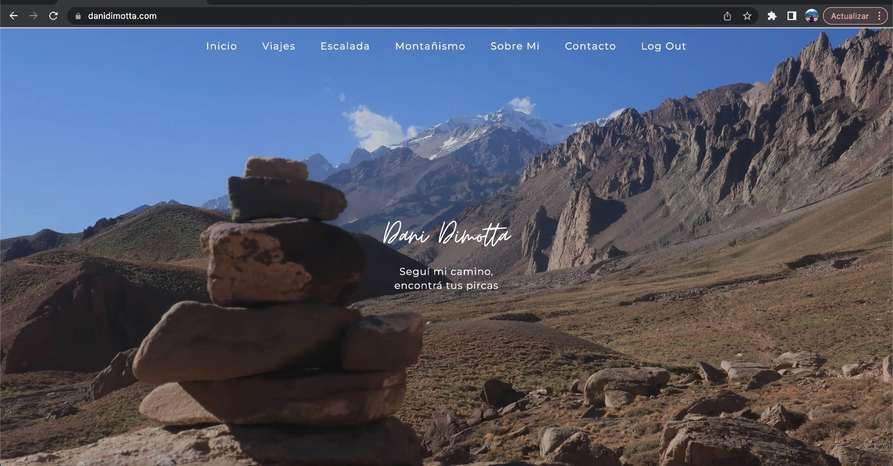
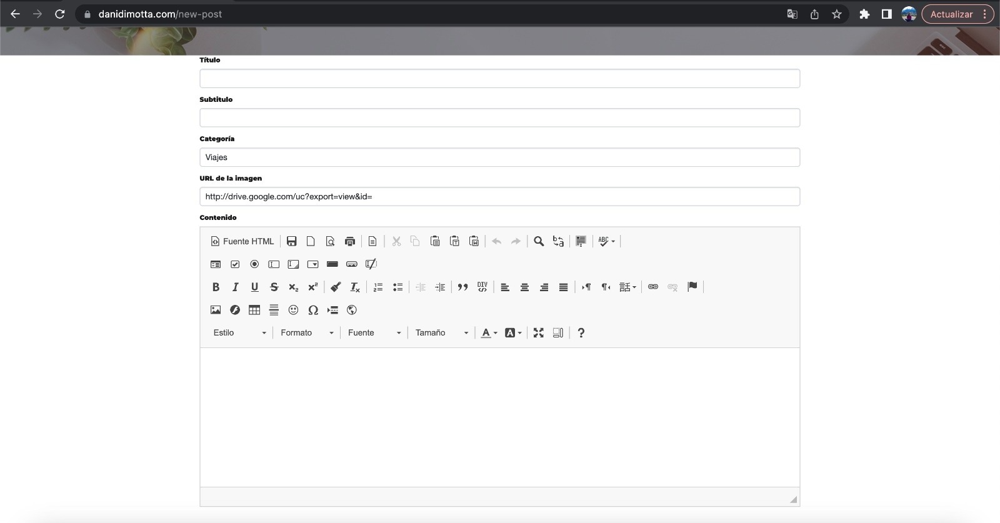

<h1>Dani Blog</h1>
    <h3>This is Dani Dimotta's personal blog, custom-made just for her.</h3>
    
Check it out: <a href="https://danidimotta.com/">danidimotta.com</a>

    
    
Are you thinking, "Another typical blog?" Well, hold on! This one comes with a couple of cool features tailored specifically for Dani.

    
Since ease of use is a priority, I've implemented a completely codeless CRUD system.

    
The design and creation of posts are handled entirely on the user's side. Dani, as the only superuser, has permission to perform CRUD operations.

    
    <h3>Other cool features include:</h3>
    <ol>
        <li>Newsletter: Subscribe and automatically receive an email notification whenever there's a new post.</li>
        <li>Comment section: Readers can ask questions or share their impressions about the post.</li>
        <li>Email notifications: The superuser receives email notifications whenever someone comments on a post.</li>
    </ol>
    <h3>Technologies Used</h3>
    <ul>
        <li>Python</li>
        <li>Flask</li>
        <li>JavaScript</li>
        <li>CKEditor</li>
        <li>PostgreSQL</li>
        <li>HTML</li>
        <li>CSS</li>
        <li>Bootstrap</li>
    </ul>
    <h3>Deployment</h3>
    
This web application is deployed on Railway.

    <h3>Future Plans</h3>
    <ol>
        <li>
            <h3>Shop</h3>
            
Future plans include creating a shop where users can find personalized items.

        </li>
    </ol>
